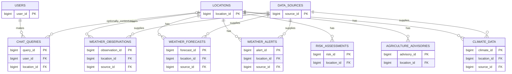

# WeatherGPT PostgreSQL Database

This folder is the database-development module for WeatherGPT SIH 2026. It stores normalized location, source, weather observation, forecast, alert, risk, agricultural advisory, climate-history, user, and chat-query records. All seed values are explicitly synthetic demonstration data; they are not official IMD data.

PostgreSQL was selected for its reliable transactions, strong relational constraints, `TIMESTAMPTZ` handling, precise `NUMERIC` values, declarative views, and query/index support. The database is independent of any frontend or backend framework.

## Setup

Install PostgreSQL and run `01_create_database.sql` once while connected to `postgres` (or another maintenance database). Then connect to `weathergpt` and run the remaining scripts in this order:

```powershell
psql -U postgres -d postgres -f database/01_create_database.sql
psql -U postgres -d weathergpt -f database/02_create_tables.sql
psql -U postgres -d weathergpt -f database/03_constraints.sql
psql -U postgres -d weathergpt -f database/04_indexes.sql
psql -U postgres -d weathergpt -f database/05_views.sql
psql -U postgres -d weathergpt -f database/06_seed_data.sql
```

`07_queries.sql` is a library of parameterized query examples. In application code, bind `$1`, `$2`, and `$3`; do not interpolate untrusted input into SQL strings.

## Architecture and tables

`users` owns application identity and query history. `locations` is the single source of geographic facts. `data_sources` identifies the origin and status of incoming datasets. `weather_observations` holds timestamped measurements; `weather_forecasts` holds one daily forecast per location/source/date; and `weather_alerts` holds time-bounded alert events. `risk_assessments`, `agriculture_advisories`, and `climate_data` add decision-support, crop, and historical information. `chat_queries` records conversational requests and can omit a location.

Weather/source child records use foreign keys with `ON DELETE RESTRICT`, preserving operational history. `chat_queries.location_id` uses `ON DELETE SET NULL`, because its query can remain useful if a referenced location is removed.



## Normalization and integrity

The schema is in 1NF: every field is atomic and each row has a primary key. It is in 2NF because attributes describe the entity identified by each single-column surrogate key, with natural uniqueness enforced where needed. It is in 3NF because city/coordinates live only in `locations`, source details only in `data_sources`, and user details only in `users`; dependent weather records carry keys rather than copied facts.

The schema uses identity keys, `NOT NULL`, `UNIQUE`, foreign keys, sensible defaults, and checks for coordinate ranges, humidity/probability percentages, non-negative rain and wind, temperatures, alert/risk/advisory severity, valid time intervals, and climate year/month ranges. The location, source/time, forecast/source/date, and climate/source/period unique constraints prevent duplicate records at their natural grain.

## Indexing and views

Location city/state indexes support geographic lookups. Composite location/time and location/date indexes serve the dominant latest-weather, history, and forecast paths. Alert severity/time and location/start indexes make active-alert filtering efficient. Risk, crop-advisory, climate, and chat-user indexes target their corresponding detail/history screens; the chat-location index is partial because location is optional.

`latest_weather` returns one newest observation per location. `active_weather_alerts` exposes only alerts active at query time. `location_weather_summary` joins latest weather with active-alert count and latest risk level for a compact backend payload.

## Workflow and backend boundary

```text
Weather Data Sources -> Data Collection -> Data Validation -> PostgreSQL
-> Data Storage -> Data Organization -> SQL Queries -> Data Retrieval
-> WeatherGPT Backend
```

The backend should validate/normalize incoming units and source metadata, write through parameterized SQL, and read the views or examples in `07_queries.sql`. The frontend is intentionally outside this module.
